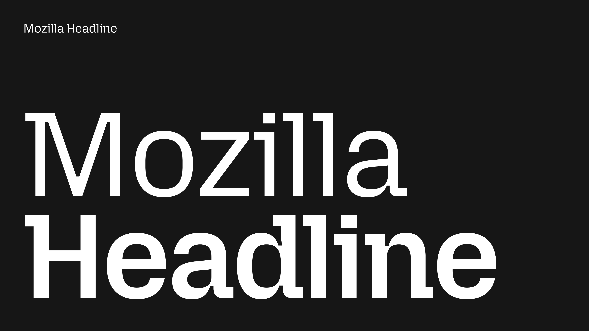
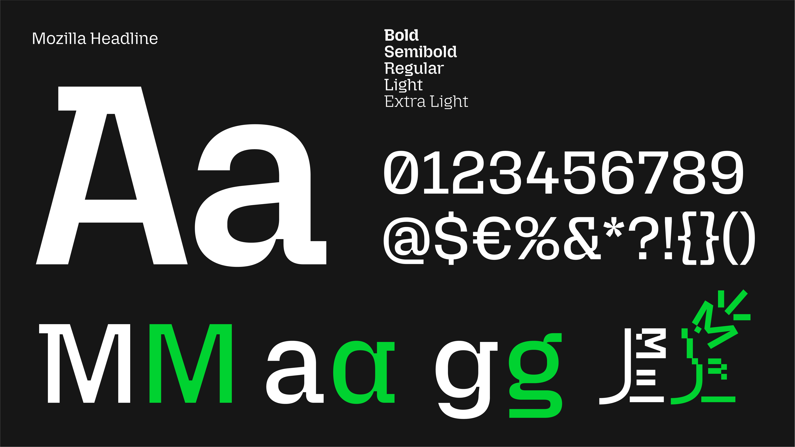

# Mozilla Headline Typeface

[![][Fontspector]](https://mozilla.github.io/mozilla-headline-type/fontspector/fontspector-report.html)
[![][OpenType]](https://mozilla.github.io/mozilla-headline-type/fontspector/fontspector-report.html)
[![][Universal]](https://mozilla.github.io/mozilla-headline-type/fontspector/fontspector-report.html)
[![][Google Fonts]](https://mozilla.github.io/mozilla-headline-type/fontspector/fontspector-report.html)
<!-- [![][Glyphset]](https://mozilla.github.io/mozilla-headline-type/fontspector/fontspector-report.html) -->
[![][Proofs]](https://mozilla.github.io/mozilla-headline-type/proof/diffenator2-report.html)

[Fontspector]: https://img.shields.io/endpoint?url=https%3A%2F%2Fmozilla.github.io%2Fmozilla-headline-type%2Fbadges%2FFontspectorQA.json
[OpenType]: https://img.shields.io/endpoint?url=https%3A%2F%2Fmozilla.github.io%2Fmozilla-headline-type%2Fbadges%2FOpentypeSpecificationChecks.json
[Universal]: https://img.shields.io/endpoint?url=https%3A%2F%2Fmozilla.github.io%2Fmozilla-headline-type%2Fbadges%2FUniversalProfileChecks.json
[Google Fonts]: https://img.shields.io/endpoint?url=https%3A%2F%2Fmozilla.github.io%2Fmozilla-headline-type%2Fbadges%2FFontFileChecks.json
[Outline Correctness]: https://img.shields.io/endpoint?url=https%3A%2F%2Fmozilla.github.io%2Fmozilla-headline-type%2Fbadges%2FOutlineCorrectnessChecks.json
[Glyphset]: https://img.shields.io/endpoint?url=https%3A%2F%2Fmozilla.github.io%2Fmozilla-headline-type%2Fbadges%2FGlyphsetChecks.json
[Proofs]: https://img.shields.io/badge/Diffenator-proofs-teal

Mozilla Headline and Mozilla Text are our custom typefaces for the Mozilla brand. This typeface font family features a unique uniwidth design. It maintains standardized spacing and kerning across all weights and styles, eliminating risk of text reflow to preserve the integrity of the layout and enhance the user’s experience. Read more about [Mozilla’s rebrand here](https://blog.mozilla.org/en/mozilla/mozilla-brand-next-era-of-tech/).

## License

This Font Software is licensed under the SIL Open Font License, Version 1.1. A copy of this license is included in this repository and is also available with a FAQ at [https://openfontlicense.org](https://openfontlicense.org)

## Code of Conduct

This repository is governed by Mozilla's [Community Participation Guidelines](https://github.com/mozilla/mozilla-headline-type/blob/main/CODE_OF_CONDUCT.md).

## Repository Layout

This font repository structure is inspired by [Unified Font Repository v0.3](https://github.com/unified-font-repository/Unified-Font-Repository), modified for the Google Fonts workflow.

Building, testing and releasing is documented in the [template repository](https://github.com/googlefonts/googlefonts-project-template#readme) along with instructions how to keep the template resources and automation updated.
